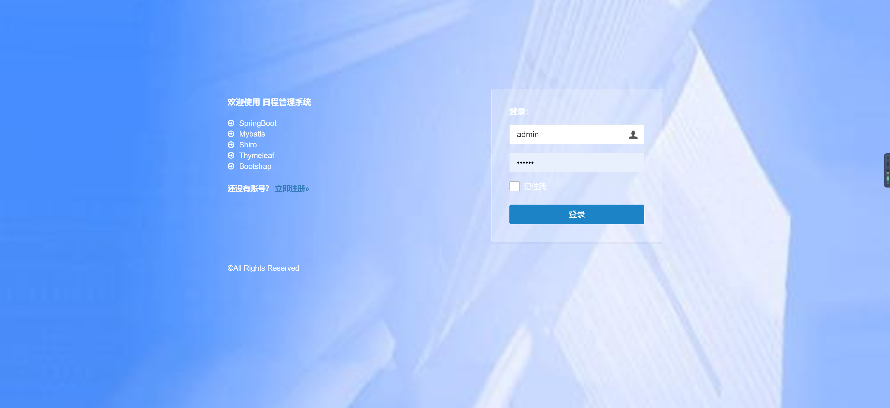
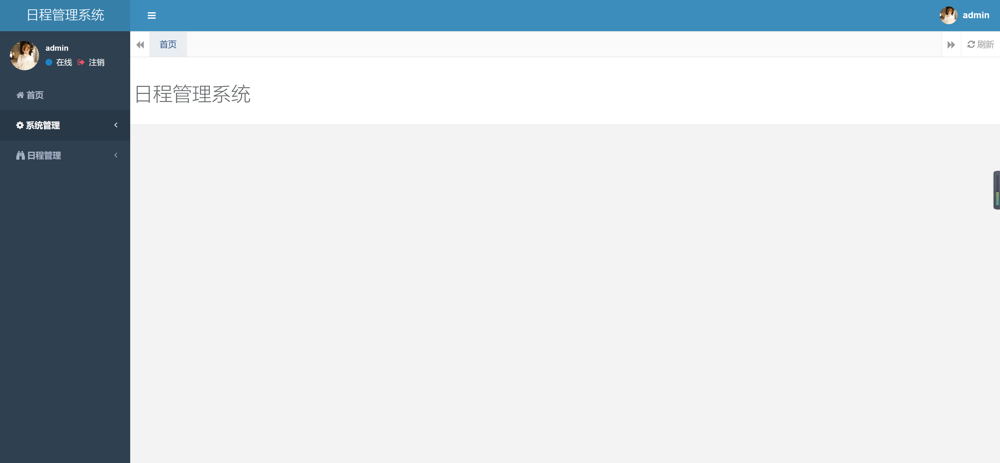
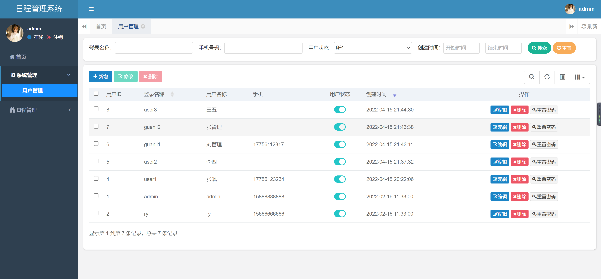
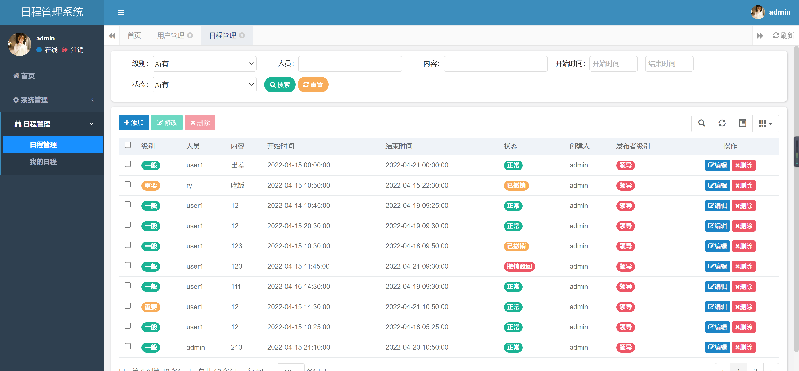
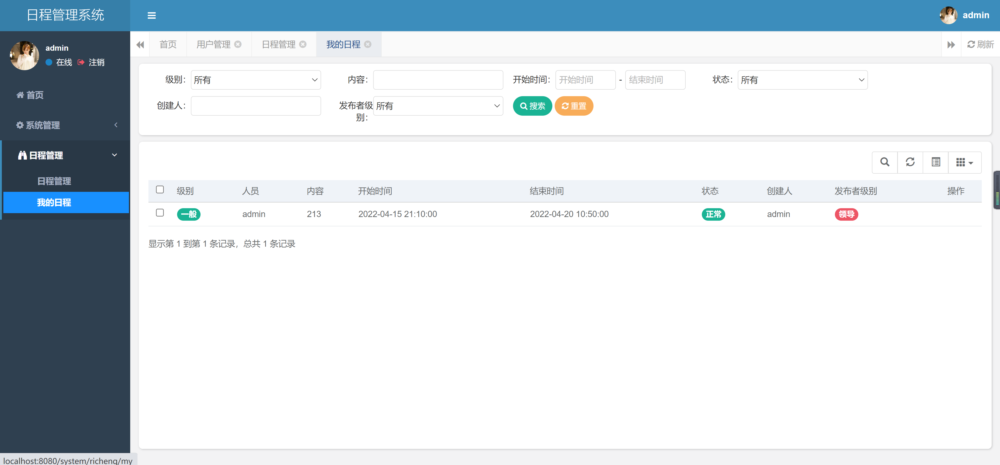
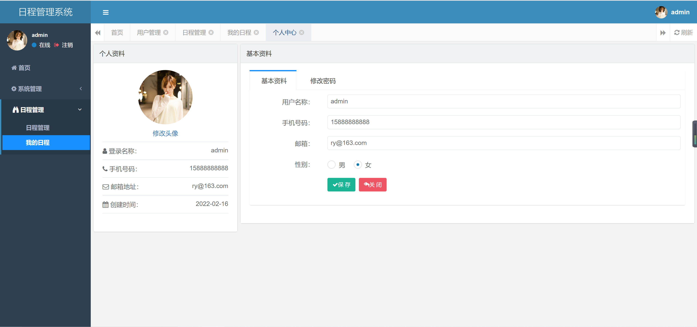

<h1 align="center">日程管理系统</h1>

## 简介
日程管理系统：角色分为管理员、用户；功能包括日程管理、日历视图、任务列表、用户管理和个人信息管理，提升用户时间管理能力，适用于多种场景。    --计算机毕业设计源码；毕设源码；java毕业设计源码

## 联系方式

<h3 align="center">获取完整代码与数据库文件 + 微信：bysj5151 QQ: 86050149 QQ群: 783742310</h3>

<h3 align="center">可帮忙远程部署 包运行成功！提供远程部署、修改代码、设计文档指导、代码讲解等服务！</h3>

## 功能介绍（完整见运行截图）
管理员：基本功能包括登录、注册、管理和退出。系统管理方面，管理员可以通过导航菜单访问主页和日程管理功能，编辑、添加、删除日程条目，管理用户信息，包括修改用户状态和重置密码。管理员能够利用搜索、筛选功能提高管理效率，确保日程和用户信息的准确性和安全性。

用户：基本功能包括登录、注册和退出。用户在日程管理系统中可以查看和编辑个人日程，通过日历视图和任务列表管理时间，设定事件提醒，确保不错过重要安排。此外，用户可更新个人信息，如用户名、手机号和邮箱，以及修改密码，确保账户安全。简洁的界面设计提高了用户体验，帮助用户高效安排和管理时间。

## 运行截图

本代码来源于网络,仅供学习参考使用!

